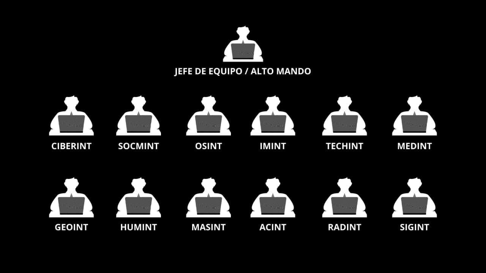

<!-- BQPTheory-->

  

<h1 align="center">
  「C-CIS - Cyber Intelligence Specialist - Tools」
</h1>

<h4 align="center">
</h4>  

 Desarrollado para la certificación de C-CIS de la empresa TPX MX. 

  
- Este repositorio esta creado para las herramientas de las disciplinas, que se utilizan dentro de ciberinteligencia.
- This repository is created for the tools of the disciplines, which are used within cyber intelligence.
- Cyber Intelligence Specialist, [(C-CIS).](https://tpx.mx/entrenamiento/c-cis)
<h3 align="center"> 
  ¯¯¯¯¯¯¯¯¯¯¯¯¯¯¯¯¯¯¯¯¯¯¯¯¯¯¯¯¯¯¯¯¯¯¯¯¯¯¯¯¯¯¯¯¯¯¯¯¯¯¯¯¯¯¯¯¯¯¯¯¯
</h3>

  - Este repositorio tiene la finalidad de recolectar una gran cantidad de herramientas para cada una de las complejas disciplinas, que se utilizan en el área de CIBERINT o Ciberinteligencia. Recopilando herramientas privadas de empresas que brindan servicios y herramientas creadas por investigadores en Ciberseguridad y Ciberinteligencia de Software libre y Código abierto, con la finalidad de tener herramientas modernas, avanzadas para el uso de los futuros profesionales y investigadores de CIBERINT. 

 

Disciplinas dentro de ciberinteligencia: 

- [SOCMINT](https://github.com/BQPTheroy/CCIS/blob/main/README.md#socmint-tools)
- [OSINT](https://github.com/BQPTheroy/CCIS/blob/main/README.md#osint-tools)
- [CIBERINT](https://github.com/BQPTheroy/CCIS/blob/main/README.md#ciberint-tools)
- [IMINT](https://github.com/BQPTheroy/CCIS/blob/main/README.md#imint-tools)
- [TECHINT](https://github.com/BQPTheroy/CCIS/blob/main/README.md#techint-tools)
- [MEDINT](https://github.com/BQPTheroy/CCIS/blob/main/README.md#medint-tools)
- [GEOINT](https://github.com/BQPTheroy/CCIS/blob/main/README.md#geoint-tools)
- [HUMINT](https://github.com/BQPTheroy/CCIS/blob/main/README.md#humint-tools)
- [MASINT](https://github.com/BQPTheroy/CCIS/blob/main/README.md#masint-tools)
- [ACINT](https://github.com/BQPTheroy/CCIS/blob/main/README.md#acint-tools)
- [RADINT](https://github.com/BQPTheroy/CCIS/blob/main/README.md#radint-tools)
- [SIGINT](https://github.com/BQPTheroy/CCIS/blob/main/README.md#sigint-tools)

  

### SOCMINT Tools

Colección de herramientas para SOCMINT.

- Software:
- Hardware:

### OSINT Tools

Colección de herramientas para OSINT.

- Software:
- Hardware:

### CIBERINT Tools

Colección de herramientas para CIBERINT.

- Software:
- Hardware:

### IMINT Tools

Colección de herramientas para IMINT.

- Software:
- Hardware:

### TECHINT Tools

Colección de herramientas para TECHINT.

- Software:
- Hardware:

### MEDINT Tools

Colección de herramientas para MEDINT.

- Software:
- Hardware:

### GEOINT Tools

Colección de herramientas para GEOINT.

- Software:
- Hardware:

### HUMINT Tools

Colección de herramientas para HUMINT.

- Software:
- Hardware:

### MASINT Tools

Colección de herramientas para MASINT.

- Software:
- Hardware:

### ACINT Tools

Colección de herramientas para ACINT.

- Software:
- Hardware:

### RADINT Tools

Colección de herramientas para RADINT.

- Software:
- Hardware:

### SIGINT Tools

Colección de herramientas para SIGINT.

- Software:
- Hardware:

### Collaborators

- [BQPTheory - Israel García.](https://github.com/BQPTheroy)

